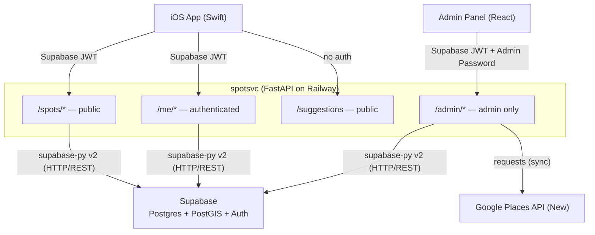
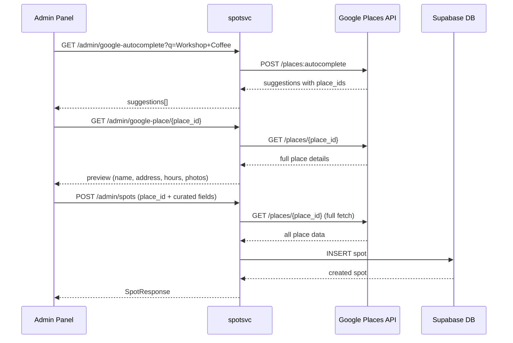

# spotsvc

Backend API for a curated London work-spots app. iOS users see cafes, gyms, hotel lobbies, and coworking spaces on a map, view details, and save favourites. An admin panel lets the team add and manage spots.

Built with **FastAPI** (async), **Supabase** (Postgres + PostGIS + Auth), and deployed on **Railway**.

---

## Architecture



**Key principles:**
- Google Places is the source of truth for place metadata (name, address, hours, photos). All Google data is fetched at spot-creation time and stored in our DB.
- Our DB adds what Google can't provide: category, access type, wifi/power/noise ratings, and editorial copy.
- Auth is fully handled between the client and Supabase — this server only validates the JWT Supabase issues.
- DB access goes through the **Supabase Python client** (HTTP/REST), not a direct Postgres connection.

---

## API Endpoints

### Public — spots (`/spots/*`)

No authentication required.

| Method | Endpoint | Description |
|--------|----------|-------------|
| `GET` | `/spots` | All active spots as map pins. Supports `?category=` and `?is_open_now=true` filters. |
| `GET` | `/spots/{id}` | Full detail for a single spot. |

`GET /spots` response:
```json
{
  "spots": [
    {
      "id": "...",
      "name": "Workshop Coffee",
      "short_address": "27 Clerkenwell Rd, London",
      "latitude": 51.5225,
      "longitude": -0.1016,
      "category": "cafe",
      "access_type": "purchase_required",
      "wifi_available": true,
      "power_outlets": true,
      "noise_level": "moderate",
      "rating": 4.5,
      "is_open_now": true,
      "cover_photo": "https://..."
    }
  ],
  "total": 42
}
```

`category` values: `cafe` `gym` `hotel_lobby` `coworking` `library` `restaurant` `other`

### Public — suggestions (`/suggestions`)

| Method | Endpoint | Description |
|--------|----------|-------------|
| `POST` | `/suggestions` | Submit a public suggestion for a new spot. No auth required. |

### Authenticated — user (`/me/*`)

Requires a valid Supabase JWT (`Authorization: Bearer <token>`).

| Method | Endpoint | Description |
|--------|----------|-------------|
| `PATCH` | `/me` | Update user profile (`display_name`, `email_opt_in`) |
| `GET` | `/me/saved-spots` | List saved spots. Optional `?collection_id=` filter. |
| `POST` | `/me/saved-spots` | Save a spot. Optionally add to one or more collections in the same call. |
| `DELETE` | `/me/saved-spots/{spot_id}` | Unsave a spot. Also removes it from all collections. |
| `GET` | `/me/collections` | List all of the user's collections with spot counts. |
| `POST` | `/me/collections` | Create a collection. Pass `source_collection_id` to copy a shareable collection. |
| `PATCH` | `/me/collections/{id}` | Rename a collection or toggle `is_shareable`. |
| `DELETE` | `/me/collections/{id}` | Delete a collection. Spots remain saved. |
| `POST` | `/me/collections/{id}/spots` | Add a spot to a collection. Also saves the spot if not already saved. |
| `DELETE` | `/me/collections/{id}/spots/{spot_id}` | Remove a spot from a collection. Does not unsave the spot. |

### Public — shareable collections

| Method | Endpoint | Description |
|--------|----------|-------------|
| `GET` | `/collections/{id}` | View a shareable collection and its spots. No auth required. Returns 404 if not shareable. |

### Admin — spot management (`/admin/*`)

Requires a valid Supabase JWT with `app_metadata.role = "admin"`, plus the `X-Admin-Password` header.

| Method | Endpoint | Description |
|--------|----------|-------------|
| `GET` | `/admin/google-autocomplete?q=` | Proxy to Google Places Autocomplete, London-biased |
| `GET` | `/admin/google-place/{place_id}` | Fetch full place details for preview before saving |
| `GET` | `/admin/spots` | List all spots — paginated, searchable by name |
| `POST` | `/admin/spots` | Create a spot (fetches all data from Google, stores in DB) |
| `PUT` | `/admin/spots/{id}` | Update curated fields on an existing spot |
| `DELETE` | `/admin/spots/{id}` | Soft-delete a spot (`is_active = false`) |
| `GET` | `/admin/suggestions` | List submitted suggestions (paginated, filterable by status) |
| `PATCH` | `/admin/suggestions/{id}` | Approve or reject a suggestion. Approving auto-creates the spot. |
| `POST` | `/admin/validate` | Validate the admin password |

**Add-spot flow:**



**`POST /admin/spots` request body:**
```json
{
  "google_place_id": "ChIJ...",
  "category": "cafe",
  "access_type": "purchase_required",
  "wifi_available": true,
  "power_outlets": true,
  "noise_level": "moderate",
  "description": "Bright, spacious cafe on Clerkenwell Road with reliable Wi-Fi.",
  "admin_notes": "Check upstairs for more seating."
}
```

### Health check

`GET /health` — returns `{"status": "ok", "db": "ok"}`. Used by Railway for deployment health checks.

---

## What's not built yet

- `POST /admin/spots/{id}/refresh` — re-fetch Google data from Google Places
- `GET /me` — fetch own profile
- `DELETE /me` — delete own account

---

## Tech stack

| | |
|---|---|
| Framework | FastAPI + uvicorn |
| Database | Supabase Postgres + PostGIS, accessed via **supabase-py v2** (HTTP/REST) |
| Auth | Supabase Auth — Apple + Google sign-in. JWT validated server-side with HS256. |
| Google Places | `requests` (sync) — Google Places API (New) |
| Deployment | Railway (Dockerfile) |

---

## Project structure

```
spotsvc/
├── app/
│   ├── main.py              # App factory, CORS, lifespan, router registration
│   ├── config.py            # Pydantic Settings (reads from env)
│   ├── dependencies.py      # get_current_user, get_admin_user, no_auth
│   │
│   ├── spots/
│   │   ├── router.py        # GET /spots, GET /spots/{id}
│   │   ├── service.py       # list_spots, get_spot, compute_is_open_now
│   │   └── schemas.py       # SpotPin, SpotDetail, SpotsResponse
│   │
│   ├── saved/
│   │   ├── router.py        # /me/saved-spots, /me/collections, /collections/{id}
│   │   ├── service.py       # save/unsave, collection CRUD
│   │   └── schemas.py       # Pydantic request/response models
│   │
│   ├── users/
│   │   ├── router.py        # PATCH /me
│   │   ├── service.py       # update_profile
│   │   └── schemas.py       # ProfileResponse, UpdateProfileRequest
│   │
│   ├── admin/
│   │   ├── router.py        # /admin/* endpoints
│   │   ├── service.py       # Google fetch + DB write logic
│   │   └── schemas.py       # Pydantic request/response models
│   │
│   ├── suggestions/
│   │   ├── router.py        # POST /suggestions, /admin/suggestions/*
│   │   ├── service.py       # Submit + approve/reject logic
│   │   └── schemas.py       # Pydantic models
│   │
│   ├── google_places/
│   │   ├── client.py        # Sync requests wrapper for Places New API
│   │   └── schemas.py       # PlaceSuggestion, PlaceDetails models
│   │
│   ├── db/
│   │   ├── database.py      # Supabase client singleton
│   │   └── models.py        # SpotCategory + AccessType enums
│   │
│   └── core/
│       └── security.py      # JWT decode + admin role check
│
├── Dockerfile
├── railway.toml
├── requirements.txt
└── .env.example
```

---

## Local setup

**Prerequisites:** Python 3.12, a Supabase project with PostGIS enabled, and a Google Places API key (New).

```bash
git clone <repo>
cd spotsvc

python -m venv .venv && source .venv/bin/activate
pip install -r requirements.txt

cp .env.example .env
# Fill in SUPABASE_URL, SUPABASE_JWT_SECRET, SUPABASE_SERVICE_ROLE_KEY,
# GOOGLE_PLACES_API_KEY, ADMIN_PWD

uvicorn app.main:app --reload
# Docs at http://localhost:8000/docs
```

**Database setup:** Run the schema SQL from `CLAUDE.md` in the Supabase SQL Editor. It creates the `spots`, `profiles`, and `saved_spots` tables, PostGIS indexes, and RLS policies.

**Setting an admin user:**
```sql
-- Run in Supabase SQL editor, replace with actual user UUID
UPDATE auth.users
SET raw_app_meta_data = raw_app_meta_data || '{"role": "admin"}'::jsonb
WHERE id = 'user-uuid-here';
```

---

## Deployment (Railway)

1. Create a new Railway project and connect the repo.
2. Set all env vars from `.env.example` in the Railway dashboard.
3. Railway detects `railway.toml` and builds the Dockerfile automatically.
4. The service starts on `$PORT` (set by Railway) with a health check on `/health`.

---

## Notable implementation details

- **Supabase client (no direct Postgres)** — All DB access goes through supabase-py v2 over HTTP/REST using the service role key, which bypasses RLS. This avoids Railway ↔ Supabase network issues with direct TCP connections.
- **Sync Google Places client** — `requests.Session` is used synchronously from async FastAPI handlers. Acceptable for the low-traffic admin surface.
- **PostGIS trigger** — The `location` geography column is set automatically by a `BEFORE INSERT` trigger from `latitude` and `longitude` float columns. Always insert lat/lng; never set `location` directly.
- **is_open_now** — Computed server-side from `regular_hours` (Google's Sunday=0 period format) and the spot's `timezone` field using `pytz`.
- **Docs in non-production only** — `/docs` and `/redoc` are disabled when `APP_ENV=production`.
